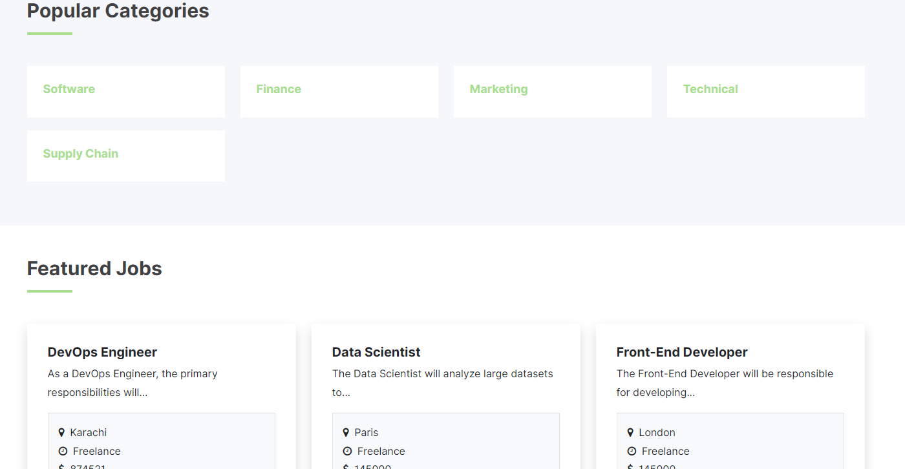
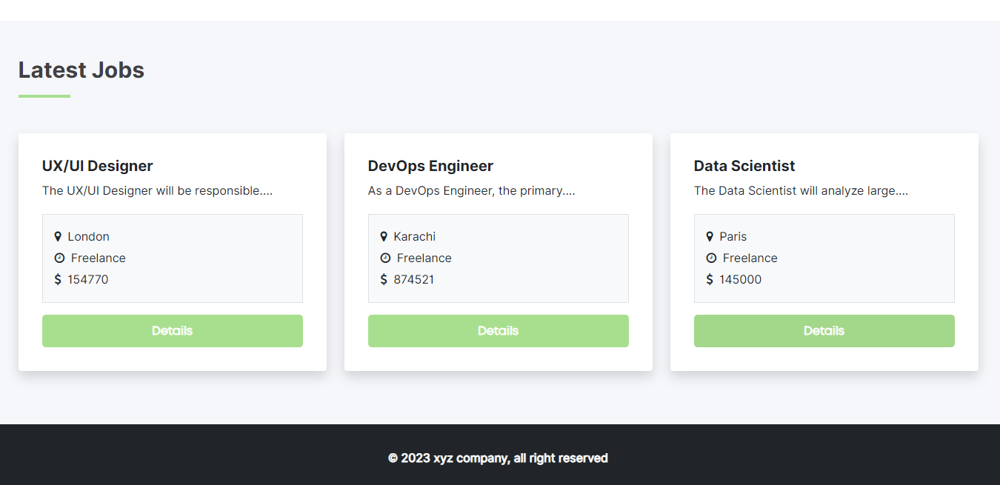
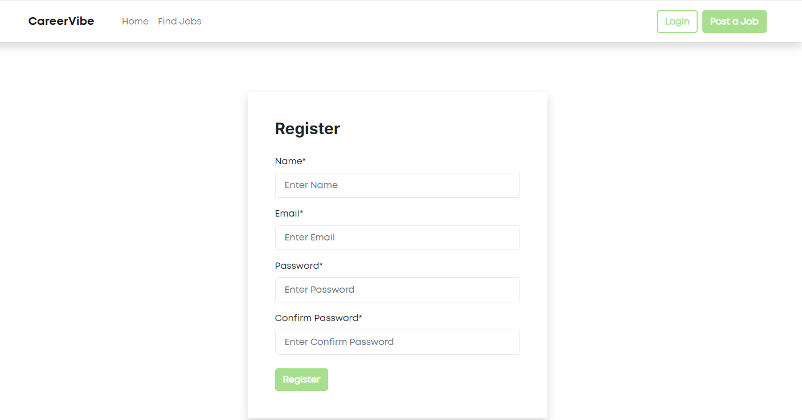
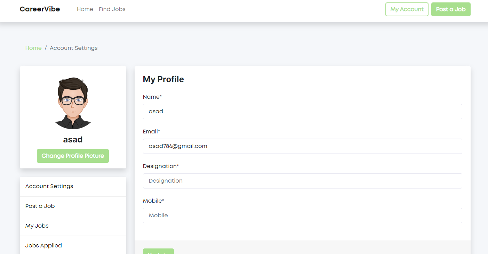
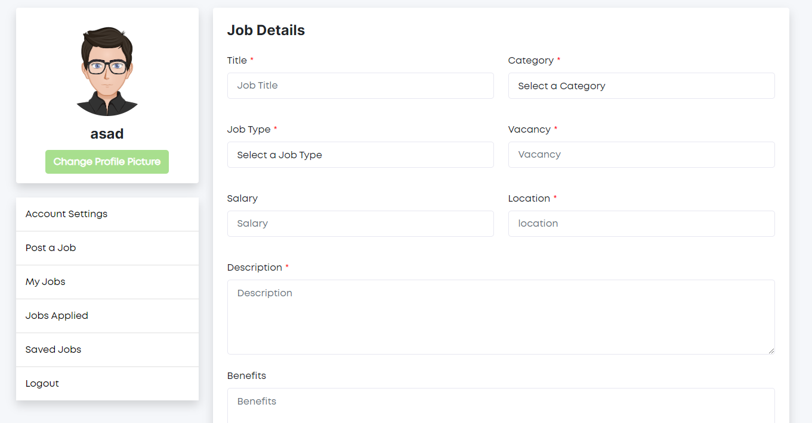
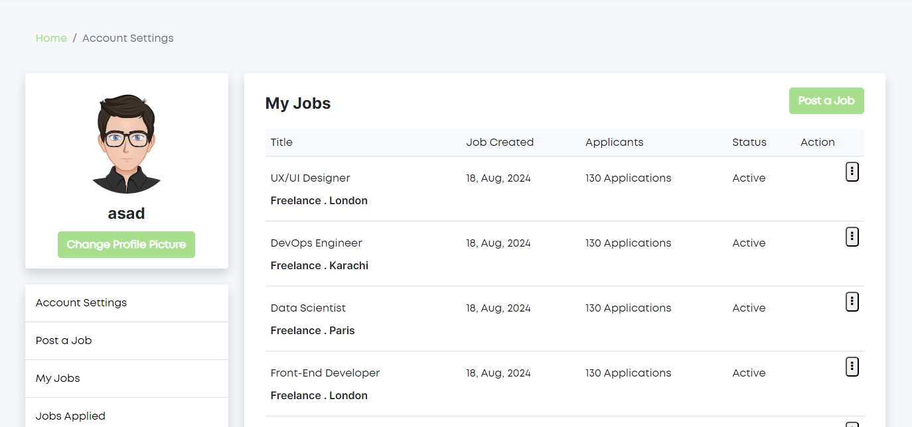
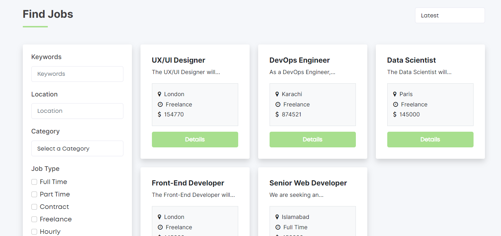

# CareerVibe - Job Portal Full Stack Laravel App

CarrerVibe is a job portal web application that allows user to create account and post jobs. User can also apply for the jobs. They can also find jobs with filter options.

This is complete job finding and posting web application that is made using laravel, bootstrap, jQuerry, MYSQL, Ajax.

## Screenshots Of My Project

Here are some screenshots of the project:

### Homepage

### Register Page

### Profile Page

### Post Job Page

### MyJobs Page

### FindJobs Page

